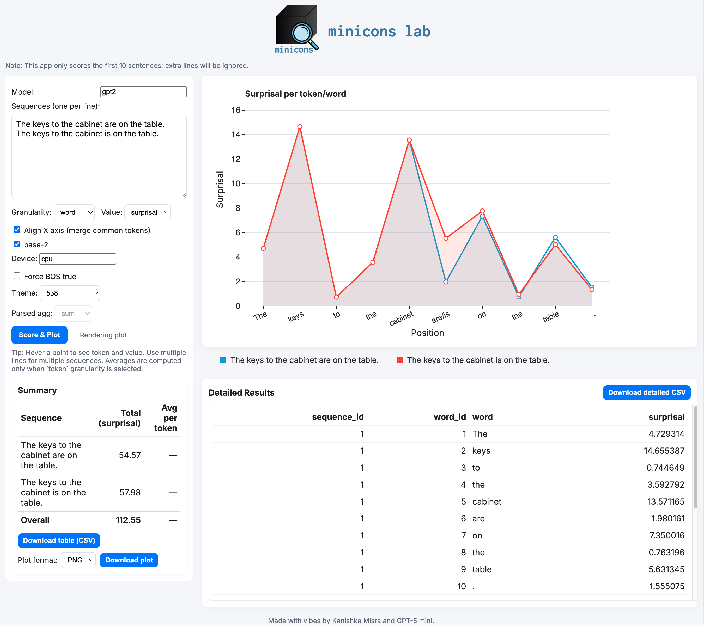

# Minicons Lab

Minicons Lab is a small Flask UI that sends sequences to a backend LM scorer and plots word/token surprisal or log-prob using a lightweight D3-based visualizer.

**Note:** This app is still under-construction, and is not meant to be used in large scale analyses just yet! E.g., it does not support batching yet.

**Another Note:** This was vibe-coded over a single day.



Quick start

1. Create a virtualenv and install dependencies:

```bash
python -m venv .venv
source .venv/bin/activate
pip install -r requirements.txt
python -c "import nltk; nltk.download('punkt')"
```

2. Run the app:

```bash
python app.py
# or specify a port: python app.py --port 5000
# or set environment variable: PORT=5000 python app.py
```

3. Open http://localhost:8888 in your browser (or use the port you specified).

Notes

- This UI only considers the first 10 non-empty lines entered in the Sequences box. If you paste more lines, only the first 10 will be scored.
- When using token granularity, ranks are always requested and shown in the detailed table and tooltips (the old "show rank" toggle was removed).
- Download behavior: when exporting the summary CSV or plotting images you'll be prompted for a filename (a sensible default is suggested). The detailed CSV default appends `_detailed` to the base name (for example `surprisal_detailed.csv`).
- The plot and table exports are client-side; SVG/PNG exports include the legend.
- The backend uses `minicons.scorer.IncrementalLMScorer`. Ensure that `minicons` is available and that model names used are supported.

If you want additional features (live line count, sorting/filtering the table, or server-side export), open an issue or edit the template at `templates/index.html`.

Debugging

- By default the app starts with debug mode disabled for safety. To enable debug mode for local development run:

```bash
python app.py --debug
# or: PORT=8888 python app.py --debug
```

Remember not to run the server with debug enabled on a publicly reachable host.
